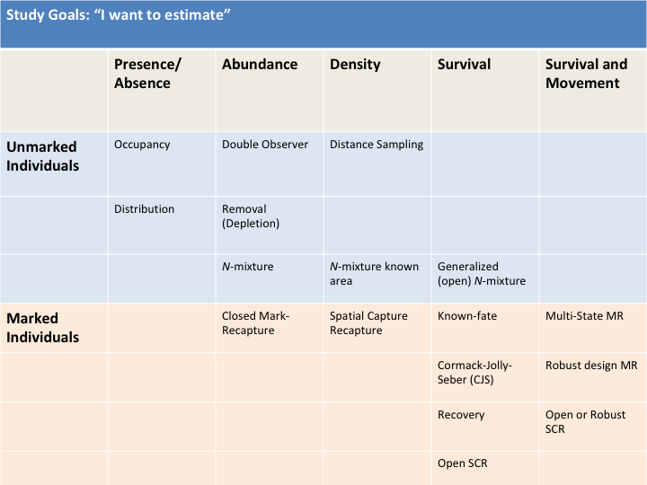

```{r setup, include = FALSE}
knitr::opts_chunk$set(warning = FALSE, message = FALSE) 
```

```{r, echo = FALSE}
library(tufte)
```

`r newthought("Learning Objectives:")` Understand the challenges in defining and measuring populations and differentiate mathematical and statistical models.

# What is a population?


```{marginfigure}
This is more space to take notes
```

Space to take notes:

\vspace{20mm}

<!---
* Individuals of a single species
* Potential interbreeding
* Living in the same place and time
-->

# What do we want to know about populations?

\vspace{40mm}

<!---
* How many individuals (abundance)
* How tightly packed (density)
* Spatial extent (distribution)
* Changes over time (temporal pop dynamics)
* How affected by the each other, other spp., the environment
* Genetic diversity and relatedness of individuals
* Adaptation to the local environment
-->

# What types of data do we collect to learn about populations?

\vspace{40mm}

<!---
* Observations of species presence/absence
* Counts of individuals
* Observations of individuals (Mark-Recapture)
* Movements among populations/sub-populations
* Population genetics
* Correlations and responses to the environment
-->

# What do we do with the data?



\newpage

# What managers want to know

I'm not a manager and this isn't a management course, so these are just a couple examples related to vertebrate populations.

* Where are the animals?
* How many are there?
* How do habitats, environmental conditions, and management units affect where they are and how many are there?
* How is the population changing?
* How do management actions and environmental change affect population sizes or densities (Population Viability Analysis - PVA)

# Population Change

Populations change through births, deaths, immigration, and emigration. This is described mathematically as $\Delta N = B - D + I - E$

# Group Activity

<style>
.alert {
background-color: #E6FFFF;
}

</style>

<div class="alert alert-info">

Pick a species and make one box for each $\Delta N$, $B$, $I$, $D$, and $E$. Then diagram all the things you think might affect each of those boxes in circles. Put arrows between circles and boxes. *Indirect effects* will be circles that affect other circles rather than connecting directly to one of the population parameter boxes.

**Yay! Now have a conceptual model** We can convert this to a *mathematical model* and then incorporate sampling uncertainty and stocastic variability to make a *statistical model*.

Highlight or star those variables or connections that you think are most important. They all might have some affect on the population dynamics but some affects will be much smaller than others and might be ignored in a final model.

Now pick one one variable that you think is especially important in affecting abundance. Put that variable on the x-axis and abundance, $N$, on the y-axis. Draw a line depicting the relationship between the two based on your best guess.

**This is your graphical model** If you add a confidence or uncertainty or variability band around the line with would be a graphical representation of a *statistical model* rather than just representing a *mathematical model*.

Finally, estimate where the line would cross the y-axis. This is your intercept, $\alpha$, in the equation for a line, $y = \alpha + \beta X$. Now estimate the slope of the line, $\beta$^[Remember that the slope of a line is the $\frac{rise}{run}$ or the amount it goes up (or down) on the y-axis for a one unit change in the x-axis]. Fill in the intercept and slope in the equation for a line.

**Hurray!** You have a mathematical model of how you think this system works. We will add more complexity and uncertainty in the future to create very powerful statistical models. That might sound daunting, but really this equation for a line and understanding how that relates to your system is 90% of the way there.

</div>

# Why make models at all?

1. **To understand a how the world works** - The natural world is messy and complex and we need ways to visualize, simplify, and describe it. We use a combination of *conceptual*, *graphical*, *mathematical* (analytical), and *statistical* models to do this. We can combine these with old and new data to understand how well our representation of the world fit with the actual ecological processes.

2. **Support management decisions** - We can conduct scenario testing, population viability analysis, and adaptive management modeling to inform management decisions. For example, this can help us understand how logging one large forest patch vs. five small forest patches might affect species of interest and decide between the two options.

3. **Predict the future** - We often want to know how conditions or actions now will affect future populations. For example, if we allow for a 5 fish per angler per day limit, what will we expect the Rainbow Trout population to be in 10 years? Is this a sustainable harvest? What is the probability that it will cause a population crash and loss of the fishery? How will it affect the other species in the community?


# Examples of why it matters

\vspace{30mm}

## How do we go about developing and testing models?

Think about the development of your models from earlier. How did you come up with the models? What was the process?

Steps from Powell and Gale [-@Powell2015] based on Starfield (1997):

1. Define the problem

2. Identify important variables

3. Create the model

4. Solve the model (through simulation or incorporating real data)[^2]

5. Interpret the results

6. Invesitgate the model sensitivity - play with your model

7. Consider the model assumptions[^3]


[^2]: From Dr. Michael Betancourt regarding generalization: The inference is conditioned on your testing (calibration) data.

[^3]: From Dr. Dan Simpson, U. Toronto: A model assumption isn't an assumption if you can test it. If you demonstrate that it's true, then it's just a precondition of your model.

# Literature Cited


