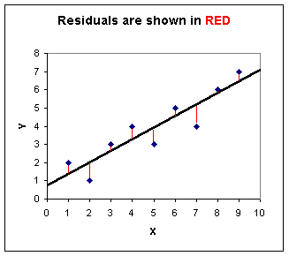

---
output:
  pdf_document: default
  html_document: default
---
# Generalized Linear Models {#linear}

## Violating Linear Model Assumptions


## Fitting a linear model


**Linear model**

$y_i = \beta_0 + \beta_1 X_1 + \epsilon_i$

$\epsilon_i \sim \mathcal{N}(\mu, \sigma)$

**Minimize residuals**



[http://mtweb.mtsu.edu/stats/dictionary/formula.htm](http://mtweb.mtsu.edu/stats/dictionary/formula.htm)


## Review: Model assumptions


What are our linear model assumptions?


## Review: Model assumptions


* Linearity
* Homogeneity of variance (Homoscedasticity)
* Normally distributed error
* Minimal multicollinearity (if multiple $X$)
* Independence of observations (no autocorrelation)


## Violating assumptions in ecology


In population biology and ecology, violating these rules is more of a rule than an exception. 

What we do depends on the assumption.


## Normality


Possibly of least concern. Given a large sample size, models are often robust to modest violations of normality.

However, we don't always have large samples sizes in ecological data sets.


## Other violations


* Linearity - will likely result in issues of homogeneity. Means your model doesn't fit and you should develop a different deterministic model
* Homogeneity - small variation is okay but otherwise a major problem. Can transform the data or make different distributional assumptions
* Multicollinearity - only a problem at high values, partially an estimation problem, partly a problem of inference. Can also bias parameter uncertainty
* Independence - The most serious problem. Can alter the model (model the residuals), transform, or group the data to address these issues.

## Case Study 1: Mallard Data 

```{r}
ducks <- read.table("Data/mallard_counts.csv", sep = ",", header = TRUE, stringsAsFactors = FALSE)
```

Counts

Log transform 

Analyze

Plot

Better solution is GLM

Poisson distribution

## Generalized Linear Model

Example with a Poisson distribution for count data. **Why do we use Poisson for counts?**

1. Distribution: $C_i \sim Poisson(\lambda_i)$
2. Link Function: $log(\lambda_i)$
3. Linear Predictor: $log(\lambda_i) = \alpha + \beta X_i$

Example when data is 0/1

When is this the case?

## Case Study 2: Wedge Clam Data 


Biomass of 398 wedge clams. Explore the data with a scatterplot matrix.
