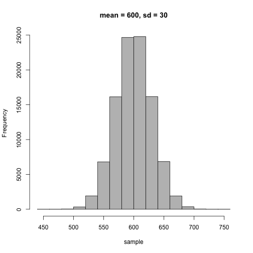

```{r setup, include = FALSE}
knitr::opts_chunk$set(warning = FALSE, message = FALSE) 
```

```{r, echo = FALSE}
library(tufte)
```

*Lab adapted from Linear Regression I by Dr. Nicholas Nagel at the University of Tennessee*

First let's load the R packages that we will use:

```{r}
library(dplyr)
library(ggplot2)
```


## Regression with the sparrow data

Let's use the sparrow data again because we are familiar with it. 

```{r}
sparrows <- read.table("Data/Sparrows.txt", 
                       header = TRUE, 
                       stringsAsFactors = FALSE)
str(sparrows)
```

Let's pick a length measurement, wingcrd, and estimate the relationship with mass (unfortunately named `wt` for weight). Last lab we plotted it and included a regression line using the `ggplot()` function in the `ggplot2` package:

```{r}
ggplot(sparrows, aes(x = wingcrd, y = wt)) + 
  geom_point() + 
  labs(x='Wing cord length (mm)', y='Mass (g)') +
  geom_smooth(method = "lm")

```


## The linear model function and interpretation

Now, let's fit the regression using the function `lm`. To use `lm`, we need to specify the y and x variables. R has a type of "short hand" for linear models that looks like this : `y ~ x`. R will interpret that $y = b_0 + b_1 x$.


```{r}
my_lm <- lm(wt ~ wingcrd, sparrows)
```

Right now, R has finished the regression, and we just need to know how to print it out.

```{r}
summary(my_lm)
```

That's it. Pretty easy, right?

What does the line predict for the mass for a bird with a wing cord of 70 mm?
It predicts $-10.77121 + 0.52972 * 70$ or 26.3 g. This might be reasonable.

What does the line predict for the mass for a bird with a wing cord of 200 mm?
It predicts $-10.77121 + 0.52972 * 200$ or 95.1 g. This would be a big bird and is totally unrealistic for a sparrow. Be careful when making predictions. In general, don't make predictions that aren't supported by your data.

We always want to check the to see if our model and data matched the assumptions of the linear model (refer back to your lecture notes). We can do this by visualizing the residuals. It's easy with the plot function on your fitted model object.

```{r}
plot(my_lm)
```

Alternatively, you can make your own residual plot.

```{r, warning = FALSE, message = FALSE}
resids <- resid(my_lm)
fitted <- fitted(my_lm)

plot(fitted, resids)

library(ggplot2)
df_resids <- data.frame(fitted, resids)

ggplot(df_resids, aes(fitted, resids)) + geom_point() + geom_hline(yintercept = 0) + geom_smooth()
```


## Calculate average response for each Species.

Now let's look at the average response by spevies and sex.

```{r}
ggplot(data=sparrows, aes(wingcrd, wt, 
                          colour = factor(Speciescode))) + 
  geom_point() + 
  geom_smooth(method = "lm") + 
  facet_wrap(~Sex)
```

```{r}
ggplot(data=sparrows, aes(Speciescode, wt, 
                          group = Speciescode)) + 
  geom_boxplot() + 
  facet_wrap(~Sex)
```

To calculate species averages, we will need to (1) `group_by` species, and then (2) summarize by `mean`. I've been doing this for awhile, so I know that `mean` won't like the NAs (missing values) in the data. So we will have to tell `mean` that it can remove NAs if it needs to.

```{r}
species_data <- sparrows %>%
  group_by(Speciescode) %>%
  summarise(wingcrd = mean(wingcrd, na.rm=TRUE),
            wt = mean(wt, na.rm=TRUE)) %>%
  ungroup()

species_data
```

Now one independent variable to model a dependent variable is unlikely to be ecologically realistic. What if we want to have more than independent variable? Maybe we want to include species as a predictor of mass, in addition to the predictor wing cord length. 


```{marginfigure}
Don't be a dummy, use dummy variables for categorical (group) predictor variables!
```

Remember that sex is a categorical variable so we have to use dummy variables. We could set up our own but R will do it for us if the data are stored as character or factor. Unfortunately, in this case `Speciescode` is stored as an integer. This means that R would interpret species 1 to be twice as large as species 2 and species 3 would be three times as larger. Therefore, we should use the `mutate` function in `dplyr` to convert it or create a new variable that is a character string.

```{r}
sparrows <- sparrows %>%
  mutate(species = as.character(Speciescode))
str(sparrows)
```

Now you can see we have a new column called `species` that stores the different species as characters (`chr`). Now we are ready to run our regression.

```{r}
lm2 <- lm(wt ~ wingcrd + species, sparrows)
summary(lm2)
```

You can see that species has a significant affect on mass. Species two is generally 1.7 g heavier than species one and a bird is expected to get 0.42 g heavier for each 1 cm increase in wing cord.

## Interpretting linear models

* p-values and null hypotheses
* $R^2$ - coefficient of determination
* coefficients ($\Beta$) - effect sizes

## Export Data

Now imagine you want to save some data or results you worked up in R. To save a set of R objects for later use in R, you can use the `save` function.

```{r}
if(!dir.exists("Output")) dir.create("Output")
```

```{r}
save(lm2, species_data, file = "Output/lab2_tutorial.RData")
```

For the above code to work, you must already have a folder called "Output" to save the results to. Otherwise you may get an error like: `Error in gzfile(file, "wb") : cannot open the connection`.

If you have a table you want to be able to open in a spreadsheet like MS Excel you can use the `write.csv` function.

```{r}
write.csv(species_data, file = "Output/species_data.csv", 
          row.names = FALSE)
```

## More Linear Regression Background and Details

## Linear model example

$$
y_i = \beta_0 + \beta_1 soil_i + \epsilon_i
$$

$$
\epsilon_i \sim \mathcal{N}(\mu, \sigma)
$$

The data, $y_i$, don't have to be normally distributed but the error (residuals) do. 

Let's see how this works and the difference between a mathematical model and a statistical model.

Make a plot of soil moisture (x-axis) vs. salamander density per hectare ($y_i$ on the y-axis). Use soil values of 0, 20, 50, 80, and 100. Assume that the intercept, $\beta_0$, equals 50 and the slope (effect of soil moisture on salamander density, $\beta_1$) is 100.

```{r, echo=FALSE, warning=FALSE, message=FALSE}
library(ggplot2)
soil <- c(0, 20, 50, 80, 100)
b0 <- 50
b1 <- 100

y <- b0 + b1 * soil

ggplot(data.frame(y, soil), aes(soil, y)) + geom_point() + geom_line() + ylab("Salamanders per ha") + xlab("Soil moisture (%)")
```

How many salamanders per hectare do you expect when the soil moisture is 0? What about 50? 100?

*Do you think that if you went out that every hectare you measured there would be the exact number of salamanders predicted?*

Now assume that there is variation (error) associated with that relationship and that in the real world even the actual density of salamanders will vary around that line.

Before we can decide how much variation, we need to review the normal distribution.

## Normal (Gaussian) distribution

$\epsilon_i \sim \mathcal{N}(\mu, \sigma)$

$\sim$ : distributed as

$\mu$ : mean

$\sigma$ : standard deviation

$\sigma^2$ : variance

Can see normal distribution expressed in terms of the variance or standard deviation

## Probability density function

$$
F(x | \mu, \sigma) = \frac{1}{{\sigma \sqrt {2\pi } }}e^{{{ - \left( {x - \mu } \right)^2 } \mathord{\left/ {\vphantom {{ - \left( {x - \mu } \right)^2 } {2\sigma ^2 }}} \right.} {2\sigma ^2 }}}
$$

## Shorthand

$\epsilon_i \sim \mathcal{N}(\mu, \sigma)$



```{r, echo = FALSE}
x <- seq(450, 750)
probability <- dnorm(x, 600, 30)

ggplot(data.frame(x, probability), aes(x, probability)) + 
  geom_line() + 
  ggtitle("Probability density function, mean = 600, sd = 30")
```

## Now lets add some variation

```{r, eval = FALSE, echo=FALSE, warning=FALSE, message=FALSE}
library(ggplot2)
soil <- c(0, 20, 50, 80, 100)
b0 <- 50
b1 <- 100

sd <- 1000
eps <- rnorm(length(soil), 0, sd = sd)

y_hat <- b0 + b1 * soil
y <- b0 + b1 * soil + eps

df <- data.frame(y, y_hat, soil, eps)

ggplot(df, aes(soil, y)) + geom_point() + geom_smooth(method = "lm") + ylab("Salamanders per ha") + xlab("Soil moisture (%)")

plot(soil, y)
```

## Putting it together - adding noise

$y_i = \beta_0 + \beta_1 X + \epsilon_i$

Deterministic:

* Intercept: $\beta_0 = 1$
* Slope: $\beta_1 = 2$
* Sample from -10 to 10 m at 1 m intervals [$X = (-10, -9, ... 9, 10)$]


$y_i = \beta_0 + \beta_1 X + \epsilon_i$

Stochastic:

* $\epsilon_i \sim \mathcal{N}(\mu, \sigma)$
* $\mu = 0$
* $\sigma = 4$


## Adding covariates (more independent variables)

$y_i = \beta_0 + \beta_1 soil_i + \beta_2 litter_i + \epsilon_i$

$\epsilon_i \sim \mathcal{N}(\mu, \sigma)$

Plug in values to try it.


## Model assumptions

```{marginfigure}
**Know the assumptions of a linear model for the exam!!!**
```

* Linearity
* Homogeneity of variance (Homoscedasticity)
* Normally distributed error
* Minimal multicollinearity (if multiple $X$)
* Independence of observations (no autocorrelation)

## Visual Checks


## Checking Model Assumptions in R

Now if you remember, we ran a regression of wing cord and sex on mass (`wt`) for the sparrows. Let's check if the data and model matched the assumptions for a linear regression. The key are the residual plots. R has the handy feature of having special plotting options for many special objects such as those from regression models. Just type `plot()` and insert your model results object.

```{r}
plot(lm2)
```

This is great, the fitted vs. residuals plot doesn't show any significant heterogeneity or bias or other patterning. Of less importance but still good to look at, the qq-plot doesn't show major deviations from normality. I would be very happy to use these data with this model. I trust the results of this model and would draw biological inference from it.

## Commands learned in this lab

Base R

- `$`
- `mean( , na.rm=TRUE)`
- `lm()`
- `save()`
- `write.csv()`
- `as.character()`

tidyverse (dplyr)

- `%>%`
- `group_by()`
- `summarise()`
- `mean()`

ggplot

- `geom_smooth(, method='lm')`


## Rprojects and Working Directories


