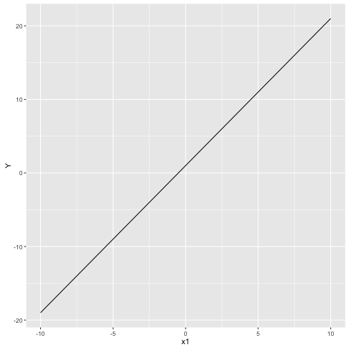
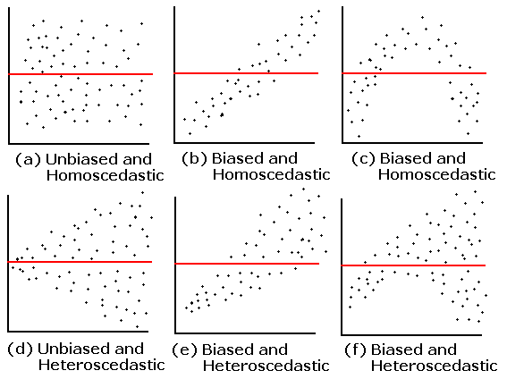

---
output:
  pdf_document: default
  html_document: default
---
# Linear Models {#linear}

## Statistical models

response = deterministic part (mathematical model) + stochastic part

* deterministic: systematic or mechanistic part of the model (e.g. equation of a line or curve)
* stochastic: random, unexplained part of the model (error distribution)

The stochastic part changes it from just a mathematical model to a statistical model. We will see how this works with linear models first.

## Linear models (regression)

Before we can deal with counts or even presence/absence data, it is helpful to understand how linear regression works in the simplest of cases.

Linear Model (LM)

* LM: Continuous response variable $[-\infty, \infty]$ 
* Assume normal error distribution

Generalized Linear Model (GLM)

* Counts and Presence/Absence (P/A)
* Use distributions besides normal

## Linear Model

response = deterministic part + stochastic part

response variable = model + error

Used to describe the relationship between variables and the amount of variation explained by the independent variables (deterministic part)

* Dependent variable = response variable (often $Y$)
* Independent variable = predictor, covariate (often $X_1, X_2, etc.$)

$Y = \beta_0 + \beta_1 X_1 + \beta_2 X_2$ (error distribution often stated or implied)

$y_i = \beta_0 + \beta_1 soil_i + \beta_2 litter_i + \epsilon_i$


## Linear model example

$y_i = \beta_0 + \beta_1 soil_i + \epsilon_i$

$\epsilon_i \sim \mathcal{N}(\mu, \sigma)$

The data, $y_i$, don't have to be normally distributed but the error (residuals) do. 

Let's see how this works and the difference between a mathematical model and a statistical model.

Make a plot of soil moisture (x-axis) vs. salamander density per hectare ($y_i$ on the y-axis). Use soil values of 0, 20, 50, 80, and 100. Assume that the intercept, $\beta_0$, equals 50 and the slope (effect of soil moisture on salamander density, $\beta_1$) is 100.

```{r, echo=FALSE, warning=FALSE, message=FALSE}
library(ggplot2)
soil <- c(0, 20, 50, 80, 100)
b0 <- 50
b1 <- 100

y <- b0 + b1 * soil

ggplot(data.frame(y, soil), aes(soil, y)) + geom_point() + geom_line() + ylab("Salamanders per ha") + xlab("Soil moisture (%)")
```

How many salamanders per hectare do you expect when the soil moisture is 0? What about 50? 100?

*Do you think that if you went out that every hectare you measured there would be the exact number of salamanders predicted?*

Now assume that there is variation (error) associated with that relationship and that in the real world even the actual density of salamanders will vary around that line.

Before we can decide how much variation, we need to review the normal distribution.

## Normal (Gaussian) distribution

$\epsilon_i \sim \mathcal{N}(\mu, \sigma)$

$\sim$ : distributed as

$\mu$ : mean

$\sigma$ : standard deviation

$\sigma^2$ : variance

Can see normal distribution expressed in terms of the variance or standard deviation

## Probability density function

$$
F(x | \mu, \sigma) = \frac{1}{{\sigma \sqrt {2\pi } }}e^{{{ - \left( {x - \mu } \right)^2 } \mathord{\left/ {\vphantom {{ - \left( {x - \mu } \right)^2 } {2\sigma ^2 }}} \right.} {2\sigma ^2 }}}
$$

### Shorthand

$\epsilon_i \sim \mathcal{N}(\mu, \sigma)$


```{r, echo = FALSE}
x <- seq(450, 750)
probability <- dnorm(x, 600, 30)

ggplot(data.frame(x, probability), aes(x, probability)) + geom_line() + ggtitle("Probability density function, mean = 600, sd = 30")
```

<!-- ### Now lets add some variation -->

```{r, eval = FALSE, echo=FALSE, warning=FALSE, message=FALSE}
library(ggplot2)
soil <- c(0, 20, 50, 80, 100)
b0 <- 50
b1 <- 100

sd <- 1000
eps <- rnorm(length(soil), 0, sd = sd)

y_hat <- b0 + b1 * soil
y <- b0 + b1 * soil + eps

df <- data.frame(y, y_hat, soil, eps)

ggplot(df, aes(soil, y)) + geom_point() + geom_smooth(method = "lm") + ylab("Salamanders per ha") + xlab("Soil moisture (%)")

plot(soil, y)
```

## Putting it together - adding noise

$y_i = \beta_0 + \beta_1 X + \epsilon_i$

Deterministic:

* Intercept: $\beta_0 = 1$
* Slope: $\beta_1 = 2$
* Sample from -10 to 10 m at 1 m intervals [$X = (-10, -9, ... 9, 10)$]



$y_i = \beta_0 + \beta_1 X + \epsilon_i$

Stochastic:

* $\epsilon_i \sim \mathcal{N}(\mu, \sigma)$
* $\mu = 0$
* $\sigma = 4$


## Adding covariates (more independent variables)

$y_i = \beta_0 + \beta_1 soil_i + \beta_2 litter_i + \epsilon_i$

$\epsilon_i \sim \mathcal{N}(\mu, \sigma)$

Plug in values to try it.


## Model assumptions

* Linearity
* Homogeneity of variance (Homoscedasticity)
* Normally distributed error
* Minimal multicollinearity (if multiple $X$)
* Independence of observations (no autocorrelation)


## Model assumptions




## Our residual plot


## Moving Forward

The linear model is incredibly powerful and is used in the majority of ecological papers, even if in a more complicated form. 

Much of this semester will be examining all the ways vertebrate data violate the assumptions and what we can do about it.

Before we get to complicating things, we will go over how to fit linear models to our data (how do we know what the intercept and slopes are when we just have data?).


