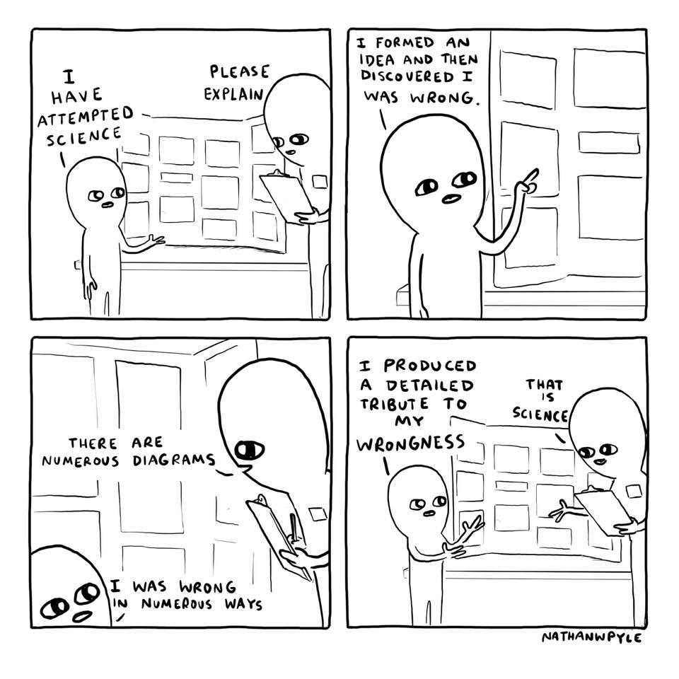

```{r setup, include = FALSE}
knitr::opts_chunk$set(warning = FALSE, message = FALSE) 
```

```{r, echo = FALSE}
library(tufte)
```


`r newthought("Learning Objectives:")`

1. Learn to run generalized linear models in R

2. Improve understanding of regression outputs

3. Develop skills in predicting expected outcomes from regression models

4. Compare models using AIC and differentiate the best model


```{r, out.width='100%', fig.align='center', fig.cap='All models are wrong, but some are useful. - George Box', echo = FALSE}

```

## Introduction

Remember our assumptions of linear models:

* Linearity
* Homogeneity of variance (Homoscedasticity)
* Normally distributed error
* Minimal multicollinearity among independent variables (if multiple $X$)
* Independence of observations (no autocorrelation)

The (ecological) processes that generate different patterns and our observational processes in sampling to generate representative data of these patterns do not always meet the assumptions of linear regression. In fact, you will find that in ecology we almost always violate these assumptions. These deviations from the requirements of the model mean that we have to use different methods to analyze the data. Generalized linear models represent an approach to handling particular violations of linear models (that assume normal distributions).

For example, if we are counting the number of animals in plots across the landscape (or parasites in plant or animal tissue samples), we know that the counts must be integers and they must be zero or greater. A normal (Gaussian) distribution can range from negative infinity to infinity and is continuous so values can be any real number, not just integers. Luckily, we have the Poisson distribution at our disposal, which has the properties we are looking for. The Poisson ranges from 0 to infinity and is discrete meaning that it is comprised of whole numbers (integers). 

```{marginfigure}
Poisson distribution. discrete. range: 0 - $\infty$. mean = variance
```

The Poisson is defined by a single parameter, $\lambda$ which is the Greek letter lambda. This is both the mean and the variance. Below are some examples of Poisson distributions with different values of $\lambda$. You can run this code and see how the distribution changes with different values.

```{r, warning = FALSE, message=FALSE}
hist(rpois(1000, lambda = 2))

hist(rpois(1000, lambda = 20))
```

So this fixes a potential problem with our modeling distributional assumptions. However, typically when counting things our error gets larger as our counts get larger. For example, if we were counting a flock of 10 snow geese and our error rate was 10% then we'd only be off by 1 goose. However if the flock was 100 geese and we had the same error rate, we would be off by 10 geese. If the flock was 1000 geese (*go to Bombay Hook NWR in Delaware in the winter to see this*), we could over or under count by 100 geese. Therefore, when using a Poisson distribtion for a Generalized Linear Model (GLM), we typically use a log link. This link serves two purposes. It makes it so the expected error grows with the increasing counts and links the linear predictor model that can range into negative values to the Poisson distribution.

1. Distribution: $C_i \sim Poisson(\lambda_i)$
2. Link Function: $log(\lambda_i)$
3. Linear Predictor: $log(\lambda_i) = \alpha + \beta X_i$

So even if $\alpha + \beta X_i = -3$ then this is equal to the $log(\lambda_i)$ and therefore $\lambda_i = 0.0498$, which is still above 0.

## GLM with Count Data

So let's try this with real data. These are real counts of brook trout across the eastern US from electrofishing.

```{r}
trout <- read.csv("Data/Trout/regional_occupancy_data.csv", 
                  stringsAsFactors = FALSE)
str(trout)
```

These are the environmental and landscape covariates that might be useful for our regression.

```{r}
covariates <- readRDS("Data/Trout/covariates.rds")
str(covariates)
```

## Select covariates and join with trout data

```{r, warning=FALSE, message=FALSE}
library(dplyr)

df_trout <- trout %>%
  left_join(covariates) %>%
  filter(!is.na(catch))
```

```{marginfigure}
`left_join()` to combine datasets based on common column names
```

## Run GLM

Let's see if the amount of forest cover in the catchment (drainage) affects the number of observed trout.

```{r}
glm1 <- glm(catch ~ forest, data = df_trout, 
            family = poisson(link = "log"))
summary(glm1)
```

It appears there is a significant positiv affect of forest on trout counts. However, with 13,000+ data points it's not hard to reject the null hypothesis. The effect size is more important in this case and we can see that it's a positive moderate effect of $e^0.042$ or roughly 1 more trout per 100 m stream reach (sample distance) for every 1% increase in forest cover. Even though 0.042 is a small value, it's on the log scale and if we had a 30% increase in forest cover, it would actually add a lot of trout to a stream.

```{marginfigure}
Effect size is at least as important as a $p$-value and must be put in the context of the data and species.
```

## Model Comparison

A model with just forest cover is probably a bit overly simplistic, especially with 13,000 data points from which to draw inference. Let's try a few other models and do some model comparison using $AIC_c$.

```{marginfigure}
vignette("AICcmodavg")
help("AICcmodavg")
```

```{r}
library(AICcmodavg)

glm2 <- glm(catch ~ forest + ann_tmax_c + winter_prcp_mm, 
            data = df_trout, family = poisson(link = "log"))

glm3 <- glm(catch ~ forest + ann_tmax_c + winter_prcp_mm + 
              AreaSqKM * winter_prcp_mm, 
            data = df_trout, family = poisson(link = "log"))

# make list of models
models <- list(glm1, glm2, glm3)

# names of models
mod_names <- c("forest", 
               "forest-temp-precip", 
               "Area interaction")

# makde AIC table
aictab(cand.set = models, modnames = mod_names)
```

What we see is that the $\Delta AIC_c$ is greater than 2 between the top model and the next best model so we can conclude that the model complex model with the interaction between area and precipitation (representing flow) is the best model so we should look at the model results.

```{r}
summary(glm3)
```

```{marginfigure}
DO NOT mix model selection (AIC) and null hypothesis testing (p-values)
```

Ignore the $p$-values since we did model selection and focus on the effect sizes and model fit or predicitive ability (hold out data for validation). We can expect more trout with more forest and higher temperatures but fewer with more winter rain (scouring of eggs and young of the year in the cobble) and larger drainage areas.

## Logistic Regression (GLM with binomial distribution)

If we have any yes/no or presence/absence data, we can do a logistic regression, which is just another name of a GLM with a binomial distribution. We typically use a logit link with the binomial distribution to keep the range of values between zero and one.

1. Distribution: $Y \sim binomial(p, N)$
2. Link Function: $log(\frac{p}{1 - p})$
3. Linear Predictor:$log(\frac{p}{1 - p}) = \alpha + \beta X_i$

Let's pretend we just had presence-absence data for the trout and run a model. First, I will convert any counts > 0 to 1.

```{r}
df_trout$pres <- ifelse(df_trout$catch > 0, 1, df_trout$catch)

glm4 <- glm(pres ~ forest + 
              ann_tmax_c + 
              winter_prcp_mm + 
              AreaSqKM * winter_prcp_mm, 
            data = df_trout, 
            family = binomial(link = "logit"))

summary(glm4)
```

