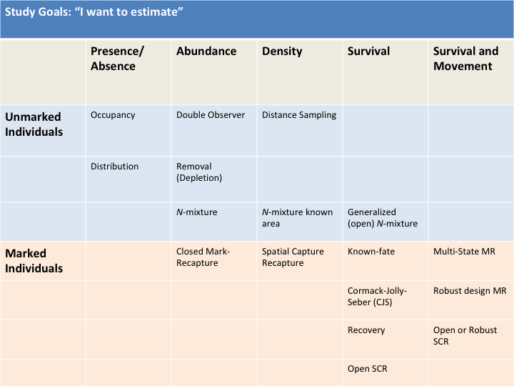
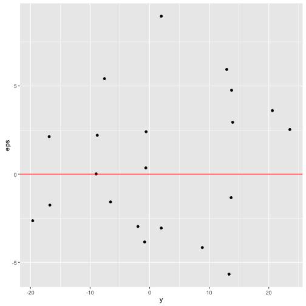

--- 
title: "Quantitative Analysis of Vertebrate Populations"
author: "Daniel J. Hocking"
date: "`r Sys.Date()`"
site: bookdown::bookdown_site
documentclass: book
bibliography: [book.bib, packages.bib]
biblio-style: apalike
link-citations: yes
description: "Frostburg State University BIOL 414/514. A survey of quantitative techniques used to describe, analyze and model vertebrate population phenomena and interactions among populations."
---

```{r include=FALSE}
# automatically create a bib database for R packages
knitr::write_bib(c(
  .packages(), 'bookdown', 'knitr', 'rmarkdown'
), 'packages.bib')
```

# Course Syllabus - Graduate Students

***

**Frostburg State University**

**Course Number:** BIOL 514

**Semester:** Fall

**Year:** 2018

### Instructor

**Dr. Daniel Hocking**, Compton 309, [djhocking@frostburg.edu](mailto:djhocking@frostburg.edu), 301-687-4343

### Meeting Times and Locations

**Lecture:** MW 10:00 - 10:50 AM; CCIT 127B

**Laboratory:** F 8:00 - 10:50 AM; CCIT 127B

**Office Hours:** Monday 11:00 - 12:00; Tuesday 9:00 - 11:00 AM, Wednesday 11:00 - 12:00 AM, Thursday 12:00 - 1:00 pm; or by appointment

***

### Description

A survey of quantitative techniques used to describe, analyze and model vertebrate population phenomena and interactions among populations.

### Prerequisites

MATH 120 or a course in calculus, MATH 109/209; BIOL 150, 160 or 161. BIOL 340 (General Ecology) recommended but not required.

### Learning Objectives

* Gain understanding of population dynamics
* Learn how to model abundance and distribution of vertebrate populations
* Gain experience interpretting and analyzing existing population data
* Increase understanding of study design for collecting population data
* Gain experience with field methods for count data and mark-recapture
* Develop computational skills for fish and wildlife management
* Learn basic scientific programming skills in the R language

### Text

Powell, L. A., and G. A. Gale. 2015. Estimation of parameters for animal populations: A primer for the rest of us. Caught Napping Publications, Lincoln, Nebraska.

### Grades:

| Task                            | Points | Grade           |
|:--------------------------------|--------|--------------------|
2 Exams (100 pts each)    |      200   |   A > 90% |
Homework assignments     |      200    |  B = 80 – 89% |
Final Exam, comprehensive        |   150      |   C = 70 – 79% |
| Graduate Project     |  100    |     D = 60 – 69% |
|           |     |     F < 60% |
|      |      | |
**Total possible points**               | **650** | |

Total points and assignments may change to accommodate teaching and learning objectives. Grades are still based on percentage of total points. Grades from individual assignments will be posted on [Canvas](https://frostburg.instructure.com), **however, the grade calculated by Canvas may be incorrect because of differences in weighting of assignments**. It is your responsibility to calculate your current grade based on the grading scheme described above.

### Laboratory

**Please note that some of our labs may be conducted at local field sites. These labs will be conducted outside so you are expected to use common sense in deciding what to wear and what to bring. You will get dirty and you will get wet during these labs.** Be prepared to spend 3 hours in areas without restrooms, if you have questions about outdoor restroom etiquette please consult leave-no-trace (lnt) principles: [http://www.lnt.org/training/educationaltraining.php](http://www.lnt.org/training/educationaltraining.ph), [http://lnt.org/training/OnlineCourse/](http://lnt.org/training/OnlineCourse/) or ask the instructor if you have specific questions. You must notify the instructor during the first week of class if you are 
allergic to bees or have never been stung by a bee.  

### Expectation of Student Work

Student work is defined as assignments, homework, and other academic activities to be completed outside of instructional time, including reading, studying, writing, research etc. Students should expect to spend a minimum of two hours per week completing this work for each credit hour enrolled (thus 6 hours of work outside of class for a 3-credit course), although the time spent outside of class may increase based on the topic and level of the course.

### Course Topics and Schedule

The schedule will adjust based on the previous experience of students in the the class along with learning progress during the course. A rough outline of course topics follows:

1. Introduction to populations and animal distributions
2. Introduction to R and RMarkdown
3. Maximum likelihood, R Graphics
4. Linear models
5. Model selection (AIC)
6. Mark-recapture introduction
7. Closed populations
8. Open populations & survival
9. Robust design
10. Occupancy models for understanding species distributions
11. Abundance modeling from unmarked populations
12. Random and mixed effect models
13. Fecundity, demography, and population viability

### Important dates and information

* September 3: Labor Dat - no classes
* November 2: last day to withdraw with a "W"
* November 21 - 25: no classes (Thanksgiving Break)
* December 10: last day of classes
* December 13: Final Exam 2:30 - 5:00 pm
* Email and Canvas: Access to your email and Canvas is required for this class. Check your email daily.

### Attendance

If you miss class, you miss whatever quizzes, exams, or activities that were administered and you will receive a zero. Attendance is critical to success. Makeup exams are extremely rare, and will likely be a different format from the original exam. However, you will be allowed to make up missed exams if you have a documented, excused absence. Additionally, if the absence was planned, you must notify me before the absence.  

Documented excused absences are generally limited to the following examples: university sanctioned events (field trips, or events where the student is an athlete/performer), funerals (requires an obituary or other proof), or illness/medical emergencies (requires a doctor’s note or other proof). For all of these, documentation must be provided. If a student is participating in extracurricular activities or has an excused absence, I must be notified within one week to arrange makeup assignments.

If you have an unexcused absence, you do not need to contact me. Common examples of unexcused absences are "family emergencies", "car trouble", and "my ride is leaving early this week."  While you may deem these as legitimate excuses, accepting them as excusable absences and allowing students to make up work will only encourage widespread abuse. Makeups of any kind are not allowed for unexcused absences.

### Class Policies

There will be no cell phones on the desk or in lab. You may not eat food or use tobacco products including electronic cigarettes in class or labs. Disruptive behavior (using phones, talking, etc.): I will ask you to leave if I think you are being disruptive.

"The University will not tolerate disorderly or disruptive conduct which substantially threatens, harms, or interferes with university personnel or orderly university processes and functions.  A faculty member may require a student to leave the classroom when his/her behavior disrupts the learning environment of the class.  A student found responsible for disruptive behavior in the classroom may be administratively withdrawn from the course."

**Beacon Early Warning System:** all students should have a network of people who will support them in their educational journey. For that reason, the University uses a system known as Beacon, whereby your instructors and coaches, if applicable, can post notices about your academic behavior. For instance, if you are absent repeatedly from a class or are not completing assignments, your instructor may post a notice on Beacon. That information may be shared with your other instructors and/or your athletic coach. I will be monitoring notices posted on Beacon so that you and I may address any issues before they become obstacles to your academic success.

### Confidentiality and Mandatory Reporting

Frostburg State University and its faculty are committed to maintaining a safe learning environment and supporting survivors of violence. To meet this commitment and comply with federal and state law, FSU requires all faculty and staff (other than the confidential employees in CAPS and Brady Health) to report any instances of gender-based harassment, sexual misconduct, relationship violence, or stalking against students. This means if you share your or another FSU student’s experience with gender-based harassment, sexual misconduct, relationship violence, or, stalking, I have a duty to report the information to the University’s Title IX Coordinator. The only exception to my reporting obligation is when such incidents are communicated during class discussion, as part of an assignment for a class, or as part of a University-approved research project.
 
Faculty and staff are also obligated to report allegations of child abuse and neglect to University Police and to Child Protective Services. This obligation extends to disclosures of past abuse even if the victim is now an adult and the abuser is deceased. My duty to report suspected child abuse and neglect extends to disclosures that are made as part of classroom discussions and in writing assignments. 

If you or someone you know has experienced an incident of harassment or violence, please go to www.frostburg.edu/titleix to find information on reporting options and the resources and services available for support.

### Academic Honesty

Definition of Academic Dishonesty from your student handbook:  "Academic dishonesty is defined to include any form of cheating and/or plagiarism. Cheating includes, but is not limited to, such acts as stealing or altering testing instruments; falsifying the identity of persons for any academic purpose; offering, giving or receiving unauthorized assistance on an examination, quiz or other written or oral material in a course; or falsifying information on any type of academic record. Plagiarism is the presentation of written or oral material in a manner which conceals the true source of documentary material; or the presentation of materials which uses hypotheses, conclusions, evidence, data or the like, in a way that the student appears to have done work which he/she did not, in fact, do. In cases involving academic dishonesty, a failing grade or a grade of zero (0) for either an assignment and/or a course may be administered. Students who are expelled or suspended for reasons of academic dishonesty are not admissible to other institutions within the University System of Maryland. Suspension or expulsion for academic dishonesty is noted on a student’s academic transcript."

**Any violation of academic honesty will result in a zero for that graded work, and a repeat violation will result in failure of the course. Cheating will be reported and further disciplinary action may be pursued by the University Judicial Board** This includes plagiarism. I will check long answers, essays, and lab reports with plagiarism-checking software. When in doubt, just cite the source. There's nothing wrong with building on somone else's ideas, in fact it's the way progress in made in science. Just give that person credit. Even if you get some information from a website, don't cite what the website cited (unless you read that), just cite the website.

### Persons with Disabilities

Frostburg State University is committed to providing equal educational opportunities for students with documented disabilities. Students who require disability serves or reasonable accommodations must identify themselves as having a disability and provide current diagnostic documentation to Disability Support Services. All information is confidential. Please call x4483 or visit 150 Pullen Hall for more information.


<!--chapter:end:index.Rmd-->

# Populations and Linear Models {#pops}

## What is a population?

* Individuals of a single species
* Potential interbreeding
* Living in the same place and time

## What do we want to know about populations?

* How many individuals (abundance)
* How tightly packed (density)
* Spatial extent (distribution)
* Changes over time (temporal pop dynamics)
* How affected by the each other, other spp., the environment
* Genetic diversity and relatedness of individuals
* Adaptation to the local environment

## What types of data do we collect to learn about populations?

* Observations of species presence/absence
* Counts of individuals
* Observations of individuals (Mark-Recapture)
* Movements among populations/sub-populations
* Population genetics
* Correlations and responses to the environment

## What do we do with the data



## What managers want to know

I'm not a manager and this isn't a management course, so these are just a couple examples related to vertebrate populations.

* Where are the animals?
* How many are there?
* How do habitats, environmental conditions, and management units affect where they are and how many are there?
* How is the population changing?
* How do management actions and environmental change affect population sizes or densities (Population Viability Analysis - PVA)

## Population Change

Populations change through births, deaths, immigration, and emigration. This is described mathematically as $\Delta N = B - D + I - E$

## Group Activity

<style>
.alert {
background-color: #E6FFFF;
}

</style>

<div class="alert alert-info">

Pick a species and make one box for each $\Delta N$, $B$, $I$, $D$, and $E$. Then diagram all the things you think might affect each of those boxes in circles. Put arrows between circles and boxes. *Indirect effects* will be circles that affect other circles rather than connecting directly to one of the population parameter boxes.

**Yay! Now have a conceptual model** We can convert this to a *mathematical model* and then incorporate sampling uncertainty and stocastic variability to make a *statistical model*.

Highlight or star those variables or connections that you think are most important. They all might have some affect on the population dynamics but some affects will be much smaller than others and might be ignored in a final model.

Now pick one one variable that you think is especially important in affecting abundance. Put that variable on the x-axis and abundance, $N$, on the y-axis. Draw a line depicting the relationship between the two based on your best guess.

**This is your graphical model** If you add a confidence or uncertainty or variability band around the line with would be a graphical representation of a *statistical model* rather than just representing a *mathematical model*.

Finally, estimate where the line would cross the y-axis. This is your intercept, $\alpha$, in the equation for a line, $y = \alpha + \beta X$. Now estimate the slope of the line, $\beta$^[Remember that the slope of a line is the $\frac{rise}{run}$ or the amount it goes up (or down) on the y-axis for a one unit change in the x-axis]. Fill in the intercept and slope in the equation for a line.

**Hurray!** You have a mathematical model of how you think this system works. We will add more complexity and uncertainty in the future to create very powerful statistical models. That might sound daunting, but really this equation for a line and understanding how that relates to your system is 90% of the way there.

</div>

## Why make models at all?

1. **To understand a how the world works** - The natural world is messy and complex and we need ways to visualize, simplify, and describe it. We use a combination of *conceptual*, *graphical*, *mathematical* (analytical), and *statistical* models to do this. We can combine these with old and new data to understand how well our representation of the world fit with the actual ecological processes.

2. **Support management decisions** - We can conduct scenario testing, population viability analysis, and adaptive management modeling to inform management decisions. For example, this can help us understand how logging one large forest patch vs. five small forest patches might affect species of interest and decide between the two options.

3. **Predict the future** - We often want to know how conditions or actions now will affect future populations. For example, if we allow for a 5 fish per angler per day limit, what will we expect the Rainbow Trout population to be in 10 years? Is this a sustainable harvest? What is the probability that it will cause a population crash and loss of the fishery? How will it affect the other species in the community?

## How do we go about developing and testing models?

Think about the development of your models from earlier. How did you come up with the models? What was the process?

Steps from Powell and Gale (2015) based on Starfield (1997):

1. Define the problem

2. Identify important variables

3. Create the model

4. Solve the model (through simulation or incorporating real data)

5. Interpret the results

6. Invesitgate the model sensitivity - play with your model

7. Consider the model assumptions


<!--chapter:end:01-intro.Rmd-->

# Linear Models {#linear}

## Statistical models

response = deterministic part (mathematical model) + stochastic part

* deterministic: systematic or mechanistic part of the model (e.g. equation of a line or curve)
* stochastic: random, unexplained part of the model (error distribution)

The stochastic part changes it from just a mathematical model to a statistical model. We will see how this works with linear models first.

## Linear models (regression)

Before we can deal with counts or even presence/absence data, it is helpful to understand how linear regression works in the simplest of cases.

Linear Model (LM)

* LM: Continuous response variable $[-\infty, \infty]$ 
* Assume normal error distribution

Generalized Linear Model (GLM)

* Counts and Presence/Absence (P/A)
* Use distributions besides normal

## Linear Model

response = deterministic part + stochastic part

response variable = model + error

Used to describe the relationship between variables and the amount of variation explained by the independent variables (deterministic part)

* Dependent variable = response variable (often $Y$)
* Independent variable = predictor, covariate (often $X_1, X_2, etc.$)

$Y = \beta_0 + \beta_1 X_1 + \beta_2 X_2$ (error distribution often stated or implied)

$y_i = \beta_0 + \beta_1 soil_i + \beta_2 litter_i + \epsilon_i$


## Linear model example

$y_i = \beta_0 + \beta_1 soil_i + \epsilon_i$

$\epsilon_i \sim \mathcal{N}(\mu, \sigma)$

The data, $y_i$, don't have to be normally distributed but the error (residuals) do. 

Let's see how this works and the difference between a mathematical model and a statistical model.

Make a plot of soil moisture (x-axis) vs. salamander density per hectare ($y_i$ on the y-axis). Use soil values of 0, 20, 50, 80, and 100. Assume that the intercept, $\beta_0$, equals 50 and the slope (effect of soil moisture on salamander density, $\beta_1$) is 100.

```{r, echo=FALSE, warning=FALSE, message=FALSE}
library(ggplot2)
soil <- c(0, 20, 50, 80, 100)
b0 <- 50
b1 <- 100

y <- b0 + b1 * soil

ggplot(data.frame(y, soil), aes(soil, y)) + geom_point() + geom_line() + ylab("Salamanders per ha") + xlab("Soil moisture (%)")
```

How many salamanders per hectare do you expect when the soil moisture is 0? What about 50? 100?

*Do you think that if you went out that every hectare you measured there would be the exact number of salamanders predicted?*

Now assume that there is variation (error) associated with that relationship and that in the real world even the actual density of salamanders will vary around that line.

Before we can decide how much variation, we need to review the normal distribution.

## Normal (Gaussian) distribution

$\epsilon_i \sim \mathcal{N}(\mu, \sigma)$

$\sim$ : distributed as

$\mu$ : mean

$\sigma$ : standard deviation

$\sigma^2$ : variance

Can see normal distribution expressed in terms of the variance or standard deviation

## Probability density function

$$
F(x | \mu, \sigma) = \frac{1}{{\sigma \sqrt {2\pi } }}e^{{{ - \left( {x - \mu } \right)^2 } \mathord{\left/ {\vphantom {{ - \left( {x - \mu } \right)^2 } {2\sigma ^2 }}} \right.} {2\sigma ^2 }}}
$$

### Shorthand

$\epsilon_i \sim \mathcal{N}(\mu, \sigma)$


```{r, echo = FALSE}
x <- seq(450, 750)
probability <- dnorm(x, 600, 30)

ggplot(data.frame(x, probability), aes(x, probability)) + geom_line() + ggtitle("Probability density function, mean = 600, sd = 30")
```

<!-- ### Now lets add some variation -->

```{r, eval = FALSE, echo=FALSE, warning=FALSE, message=FALSE}
library(ggplot2)
soil <- c(0, 20, 50, 80, 100)
b0 <- 50
b1 <- 100

sd <- 1000
eps <- rnorm(length(soil), 0, sd = sd)

y_hat <- b0 + b1 * soil
y <- b0 + b1 * soil + eps

df <- data.frame(y, y_hat, soil, eps)

ggplot(df, aes(soil, y)) + geom_point() + geom_smooth(method = "lm") + ylab("Salamanders per ha") + xlab("Soil moisture (%)")

plot(soil, y)
```

## Putting it together - adding noise

$y_i = \beta_0 + \beta_1 X + \epsilon_i$

Deterministic:

* Intercept: $\beta_0 = 1$
* Slope: $\beta_1 = 2$
* Sample from -10 to 10 m at 1 m intervals [$X = (-10, -9, ... 9, 10)$]


$y_i = \beta_0 + \beta_1 X + \epsilon_i$

Stochastic:

* $\epsilon_i \sim \mathcal{N}(\mu, \sigma)$
* $\mu = 0$
* $\sigma = 4$


## Adding covariates (more independent variables)

$y_i = \beta_0 + \beta_1 soil_i + \beta_2 litter_i + \epsilon_i$

$\epsilon_i \sim \mathcal{N}(\mu, \sigma)$

Plug in values to try it.


## Model assumptions

* Linearity
* Homogeneity of variance (Homoscedasticity)
* Normally distributed error
* Minimal multicollinearity (if multiple $X$)
* Independence of observations (no autocorrelation)


## Model assumptions


## Our residual plot




## Moving Forward

The linear model is incredibly powerful and is used in the majority of ecological papers, even if in a more complicated form. 

Much of this semester will be examining all the ways vertebrate data violate the assumptions and what we can do about it.

Before we get to complicating things, we will go over how to fit linear models to our data (how do we know what the intercept and slopes are when we just have data?).


<!--chapter:end:02-linear.Rmd-->

# Maximum likelihood estimation{#mle}

In our discussion of the linear model (chapter \@ref(linear)), we didn't talk about how to fit our data to the model. By this I mean, how do we figure out what value for the intercept and slope(s) best describe (fit) our data.

<!--chapter:end:03-mle.Rmd-->

# Applications

Some _significant_ applications are demonstrated in this chapter.

## Example one

## Example two

<!--chapter:end:04-application.Rmd-->

# Final Words

We have finished a nice book.

<!--chapter:end:05-summary.Rmd-->

`r if (knitr::is_html_output()) '
# References {-}
'`

<!--chapter:end:06-references.Rmd-->

