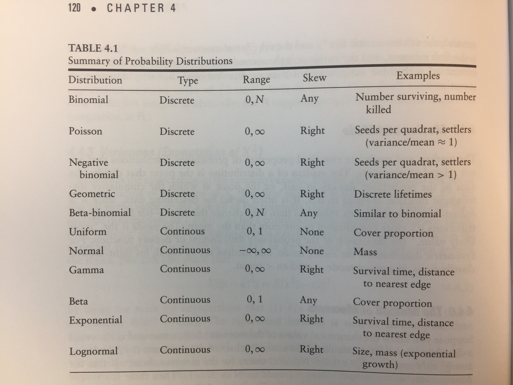

```{r setup, include=FALSE}
knitr::opts_chunk$set(echo = TRUE)
```

## Why Variation Matters

- Traditionally just a random (normal) nuisance
- Transform to linear or use non-parametric but limits inference
- Tells us about the world: counts following negative binomial indicate undescribed environmental variation or aggregate response not accounted for

## Types of "Noise" (stochastic variation)

- Measurement error: results in large CI and low statistical power
- Process variation or noise: actual part of the system

- *Environmental Stochasticity*: spatial and temporal variability caused by the environment rather than inherent randomness in the individuals
- *Demographic Stochasticity*: random chance of a particular animal living or dying ("coin toss")

## Probability Theory

1. If two events are mutually exclusive then the prob that either occurs (prob of A or B: $Prob(A \bigcup B)$) is sum of the individual probabilities:

$$
Prob(male \bigcup female) = Prob(male) + Prob(female)
$$

$$
P(3 \leq X \leq 5) = P(X = 3) + P(X = 4) + P(X = 5)
$$

## Probability Theory

2. If two events, $A$ and $B$ are not mutually exclusive - the *joint probability* that they occur together, $Prob(A \bigcap B)$ is greater than zero - and we have to account for double-counting

$$
Prob(A \bigcup B) = Prob(A) + Prob(B) - Prob(A \bigcap B)
$$

For example Prob(blue or male) = Prob(blue) + Prob(male) - Prob(blue male)

## Probability Theory

3. The probabilities of all possible outcomes of an observation or experiment sum to 1. 

Prob(male) + Prob(female) = 1


## Probability Theory

4. The *conditional probability* of $A$ given $B$, $Prob(A|B)$, is the probability that $A$ happens if we know or assume $B$ happens

$$
Prob(A|B) = \frac{Prob(A \bigcap B)}{Prob(B)}
$$

## Probability Theory

5. If the conditional probability of $A$ given $B$ equals the unconditional probability of $A$, then $A$ is independent of $B$ so

$$
Prob(A \bigcap B) = Prob(A) Prob(B)
$$

We will refer back to these rules to understand probabilities and stochastic processes later.


## Types of Distributions

- **Discrete**: the outcomes are a set of integers, usually counts resulting in non-negative integers in ecology

- **Continuous**: all real values or all real non-negative values (e.g. mass, length)


## Characteristics of Distributions: Central Moments

## First Moment

Mean (expectations)

$$
\bar x = E[x] = \frac{\sum^N_{i=1} x_i}{N}
$$


## Second Moment

Variances (Expectations of $X^2$)

$$
E[x - x^2] = E[x^2] - (\bar x)^2 
$$

$$
\sigma^2 = \frac{\sum^N_{i=1} (x_i - \bar x)^2}{N}
$$

## Third Moment

Skewness - how asymmetric a distribution is around its mean

$$
E[x - x^3] = E[x^3] - (\bar x)^3 
$$


## Fourth Moment

Kurtosis - how flat or pointy a distribution is

$$
E[x - x^4] = E[x^4] - (\bar x)^4 
$$

## Non-moment Characteristics

- Median: point that divides the area of the probability density in half or that the cumulative distribution function is 0.5. Less responsive to outliers than the mean
- Mode: the most likely value, the maximum of the probability distribution or density function. 
- Symmetric distributions mean = median = mode
- Asymmetric: right skewed generally mode < median < mean


## Common Distributions in Population Biology

- Binomial (discrete, 0, $N$)
- Poisson (discrete, 0, $\infty$)
- Negative Binomial (discrete, 0, $\infty$)
- Uniform (continuous, 0, 1)
- Normal/Gaussian (continuous, -$\infty$, $\infty$)
- Exponential (continuous, 0, $\infty$)
- Lognormal (continuous, 0, $\infty$)

## Common Distributions in Population Biology

Refer to Figure 1.




## Binomial

Fixed number of samples or "trials", each with only 2 possible outcomes (coin flips with biased coins)

- Distribution: $\left( \begin{array}{c} N \\ x \end{array} \right) p^x(1 - p)^{N-x}$
- mean:         $Np$
- variance:     $Np(1-p)$


## Binomial Examples

```{r}
p<-0.02
q<-1-p
the.probs<-numeric()#create an empty numeric vector
obs<-0:349
		for (i in 1:length(obs)){  #starts a loop - each time i will increase by 1
			the.probs[i] <- p^obs[i] * q^(349-obs[i]) * choose(349,obs[i])  #calculate the probability it is in exactly obs towns
			}

sum(the.probs)#all the probabilities should sum to 1
```

## Binomial Examples 

```{r}
# par(1,2)
plot(0:349,the.probs)	

plot(0:349,the.probs,xlim=c(0,19),type="h",lwd=10,
     main="Probability Mass Function",lend=2) #look it up on wiki
# par(1,1)
```

## Binomial Examples 

say we want to know the probability of finding a lizard in 5 or fewer canopy gaps

```{r}
sum(the.probs[1:6])#this is the sum of the probability of the lizard in 0,1,2,3,4,or 5 gaps

# or we could simply use the function dbinom() in R. It is a statisti al programming language, afterall.
# sum(dbinom(0:5,349,0.02))

pbinom(5,349,0.02) #same as above
pbinom(5,349,0.02,lower.tail=FALSE)#prob greater than 5
```

## Binomial Examples 

Cumulative probabilities

```{r}
cum.probs<-cumsum(the.probs)

cum.probs
cum.probs[1:6]# the 1:6 counts from 1 to 6 which corresponds to 0, 1, 2, 3, 4, 5 patches occupied; 
#pbinom(0:5,349,0.02) #using r function to do the same thing

plot(0:349,cum.probs,xlim=c(0,19),type="h",lwd=10,main="Cumulative Distribution Function",lend=2)
abline(h=0.95,lty=2,col="red",lwd=5)#abline will draw a line through a plot, h=0.95 means draw a horizontal line at the y-axis value of 0.95. So we can think of this as there's a 95% chance that we will find between 0 and 11 patches occupied.
```


## Binomial Examples 

```{r}
par(mfrow=c(1,2))#this sets up a plotting window with 1 row and 2 columns
plot(0:349,the.probs,xlim=c(0,19),type="h",lwd=10,main="Probability Mass Function",lend=2)
plot(0:349,cum.probs,xlim=c(0,19),type="h",lwd=10,main="Cumulative Distribution Function",lend=2)
```

## Binomial Examples 

```{r}
#another way is to use the dbinom function
x<-0:349#this creates a vector of integers from 0 to 349
length(x)# function will tell you the length of a vector

dbinom(x,349,0.02)

plot(dbinom(x,349,0.02),xlim=c(0,20),main="Probability Mass Function",type="h",lwd=5,lend=2)
plot(pbinom(x,349,0.02),xlim=c(0,20),main="Cumulative Distribution Function",type="h",lwd=5,lend=2)
```

## Binomial Examples 

```{r}
x <- 0:75
plot(dbinom(x,75,0.23),xlim=c(0,40),main="Probability Mass Function",type="h",lwd=5)
plot(pbinom(x,75,0.23),xlim=c(0,40),main="Cumulative Distribution Function",type="h",lwd=5)
par(mfrow = c(1,1))
```


## Binomial Examples 

Rickettsia is a genus of bacteria known to infect salamanders and insects. Assume for a population of mosquitos the probability of infection is 0.23. If you were to collect 75 mosquitos, what is the probability that you would have 17 or fewer infected individuals?

```{r}
pbinom(17,75,0.23)#0.5371527
# If you were to collect 75 mosquitos, what is the probability that you would have greater than 10 infected individuals?
pbinom(10,75,0.23,lower.tail=FALSE)#0.9731568
# If you were to collect 75 mosquitos, what is the probability that you would have exactly 22 infected individuals?
dbinom(22,75,0.23)#0.04517953
```

## Binomial Examples 

```{r}
x<-0:100
plot(dbinom(x,100,0.6),xlim=c(0,100),main="Probability Mass Function",type="h",lwd=5)
```

## Binomial Examples 

Let's think a little about the paramter p, and how we calculate the MLE. Let's say we flip a coin 100 times and get 60 heads. Let's look at a likelihood surface (we will talk more about likelihoods soon).

```{r}
pz<-seq(from=0.001,to=0.999,by=0.001) #possible values for p we'll explore

plot(pz,dbinom(60,100,pz),main="likelihood")#This is plotting the probability of getting 60 heads after 100 tosses across a large range of possible values for the p parameter.
plot(pz,dbinom(60,100,pz),type="l",main="likelihood") #type line makes it look nicer, and it's what we were trying to illustrate, since the number of points is arbitrary determined by the length of pz (of which we have full control over)
plot(pz,dbinom(60,100,pz,log=TRUE),type="l",main="likelihood") #type line makes 
#abline(v=mle.p,col="red",lwd=2)
plot(pz,dbinom(60,100,pz,log=TRUE),type="l",main="log likelihood")
points(0.6,max(dbinom(60,100,pz,log=TRUE)),pch=19)
arrows(0.4,0.08,0.6,0.081)
text(0.25,0.08,"MLE")

mle.p<-60/100
abline(v=mle.p,col="red",lwd=2)

abline(h=max(dbinom(60,100,pz,log=TRUE)),col="blue",lwd=2)#max() determines the maximum value of the vector returned by dbinom. abline(h=)is asking for a horizontal line. 
```

## Binomial Examples 

We can also examine how the information content affects things. What if we only flipped the coin 10 times because... and we get 6 heads and 4 tails

```{r}
pz<-c(seq(from=0.1,to=0.9,by=0.01))
plot(pz,dbinom(60,100,pz,log=T),type="l",main="likelihood")#)
lines(pz,dbinom(6,10,pz,log=T),col="red") #type line makes 
```

We get better parameter estimates as we increase the amount of information/data.

## Binomial Examples 

For you all. Start by making binomial distibutions in R with 10 trials but with p = 0.1, 0.5, and 0.9. Then we will examine other distributions.


## Poisson

Number (counts) of individuals, arrivals, events, etc. in a given place and time. 

- Distribution: $\frac{e^{- \lambda} \lambda^n}{n!}$
- mean:         $\lambda$
- variance:     $\lambda$

```
Plot Poisson distibutions in R with means of 0.8, 3, and 12
```

## Negative Binomial

Like the Poisson but where variance can be larger than the mean (*overdispersed*). Good for patch or clustered counts.

- Distribution: $\frac{n + x -1)!}{(n - 1)! x!}p^n (1-p)^x$
- mean:         $n(1-p)/p$
- variance:     $n(1-p)/p^2$


