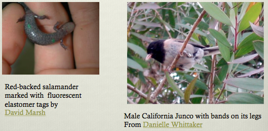
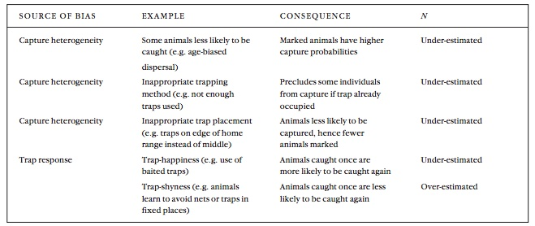
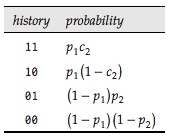
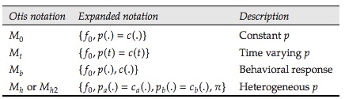

```{r setup, include=FALSE}
knitr::opts_chunk$set(echo = TRUE)
```

## Hierarchical Models

* Occupancy (distribution)
* Abundance
* Colonization-extinction
* Apparent survival
* Population dynamics

Best at landscape scale. Potentially coarse measures

## Why Mark-Recapture

* More precise estimates of abundance
* Better estimates of apparent survival
* Estimates of true survival
* Individual growth rates
* Individual fecundity and other traits over time
* Home range estimates (spatial capture-recapture)

## Why not mark-recapture

* Need to catch/trap in most cases
* Much more intensive (handling/marking time)
* Limited number of locations or populations
* Therefore can't related to landscapes very well

## General Assumptions

* Marking individuals does not affect their catchability.
* Animals do not lose marks between sampling periods.

## Marking



## Mark-recpature options

* Closed populations
* Open populations
* Robust design
* Spatial capture-recapture (with above options)

## Closed Populations

Lincoln-Peterson Estimate

* 2-session cohort mark
* individuals mix
* ratio of recaptures to captures = captures to total population
* all individuals = chance of capture

$$
N = \frac{M*C}{R}
$$

## Lincoln-Peterson Assumptions

* The population is closed, so the size is constant.
* All animals have the same chance of being caught in the first sample.
* Marking individuals does not affect their catch-ability.
* Animals do not lose marks between the two sampling periods.
* All marks are reported on discovery in the second sample.

## Closed Populations

* more than 2 sessions
* more precise estimates
* individually marked = individual heterogeneity
* trap happy or trap shy (behavioral)
* time varying detection/capture probability

## Unequal Capture Probabilities



## Closed population options

**Full Likelihood**

**Conditional Likelihood (Huggins)**

* Allows for covariates on capture probability

## Constraining the last "p"

p = probability of first capture
c = probability of recapture



## Closed Population Models




## Open Populations

## Robust Design

## Spatial Capture-Recapture