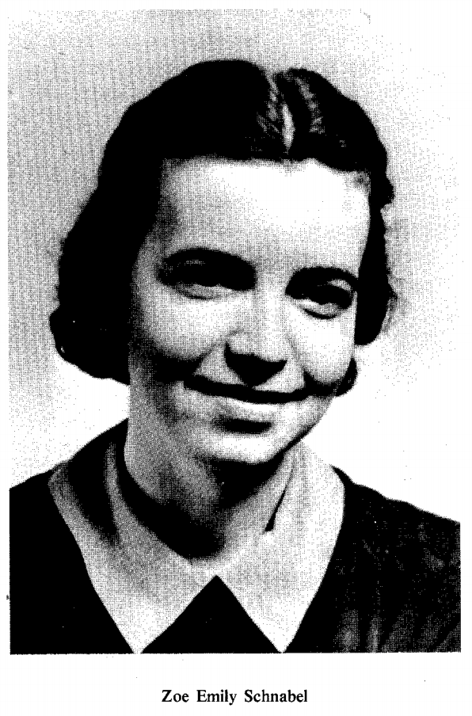

```{r setup, include=FALSE}
knitr::opts_chunk$set(echo = TRUE)
```

## Hierarchical Models

* Occupancy (distribution)
* Abundance
* Colonization-extinction
* Apparent survival
* Population dynamics

Best at landscape scale. Potentially coarse measures

## Why Mark-Recapture?

## Why Mark-Recapture

* More precise estimates of abundance
* Better estimates of apparent survival
* Estimates of true survival
* Individual growth rates
* Individual fecundity and other traits over time
* Home range estimates (spatial capture-recapture)
* Movement rates between sites if multiple MR sites (generally poor estimates)

## Why not mark-recapture?

## Why not mark-recapture

* Need to catch/trap in most cases
* Much more intensive (handling/marking time)
* Limited number of locations or populations
* Therefore can't related to landscapes very well

## General Assumptions

* Marking individuals does not affect their catchability.
* Animals do not lose marks between sampling periods.

## Marking


## Mark-recpature options

* Closed populations
* Open populations
* Robust design
* Spatial capture-recapture (with above options)

## Closed Populations

Lincoln-Peterson Estimate

* 2-session cohort mark
* individuals mix
* ratio of recaptures to captures = captures to total population
* all individuals = chance of capture
* each sample is a random sample of the whole population

$$
N = \frac{M_1*C_2}{R_2}
$$

## Lincoln-Peterson

*Powell and Gale notation*

$$
\hat N = \frac{n_1 n_2}{m_2}
$$
where

* $\hat N$: Population size (true abundance)
* $n_1$: number captured and marked in session 1
* $n_2$: number captured in session 2
* $m_2$: number of recaptures in session 2 that were marked in session 1

## Lincoln-Peterson Assumptions

* The population is closed, so the size is constant.
* All animals have the same chance of being caught in the first sample.
* Marking individuals does not affect their catch-ability.
* Animals do not lose marks between the two sampling periods.
* All marks are reported on discovery in the second sample.

## Other Closed-Population Batch Mark Models

**Chapman to correct for bias with small sample sizes**

$$
\hat N = \frac{(n_1 + 1 )(n_2 + 1)}{m_2 + 1} - 1
$$

## Other Closed-Population Batch Mark Models

**Schnabel** for more than 2 sampling sessions

$$
\hat N = \frac{\sum (C_t M_t)}{\sum R_t}
$$

* $C_t$: Number caught on day $t$
* $M_t$: Number marked previously available for capture on day $t$
* $R_t$: Number of recaptures on day $t$

## Practice Problems

Estimate the abundance using the Lincoln-Peterson, Chapman, and Schnabel methods for these data:

```{r, echo=FALSE, results='asis', message=FALSE, warning=FALSE}
library(knitr)
tab <- data.frame(Session = c("Day 1", "Day 2", "Day 3"), 
                  Captures = c(155, 175, 131),
                  Recaptures = c(0, 109, 116),
                  stringsAsFactors = FALSE)
kable(tab, caption = "Mark-recapture of Cuban Rock Iguanas (*Cyclura nubila*) on Isla Magueyes off the coast of Puerto Rico")
```

## Closed-Population Batch Mark Models

"It should be emphasized, however, that none of the solutions can be expected to provide more than an estimate of the general order of magnitude of the total population."

```{r echo=FALSE, out.width='25%'}

```


## Modern Closed Population Models

* individually marked = individual heterogeneity
* 3+ sessions
* more precise estimates
* trap happy or trap shy (behavioral)
* time varying detection/capture probability

## Unequal Capture Probabilities


## Capture Histories

Each individual gets a capture history with 1 representing the individual was observed (captured if trapping) and 0 representing not observed 

p = probability of first capture
c = probability of recapture


## Capture Histories

* 0101 = 4 sessions with not captured, captured, not captured, captured
* $p$: capture probability = probability of initial capture
* $c$: recapture probability = probability of recapture after the first capture
* 0101 = (1-$p$)$p$(1-$c$)$c$

## Capture Histories Varying in Time

0100111000 = $(1-p_1)p_2(1-c_3)(1-c_4)c_5c_6c_7(1-c_8)(1-c_9)(1-c_{10})$

## Capture Histories

*You Try*

1. 0100111000 = $(1-p_1)p_2(1-c_3)(1-c_4)c_5c_6c_7(1-c_8)(1-c_9)(1-c_{10})$
2. 1000110101
3. 0001001001

## Closed population options

**Full Likelihood**

**Conditional Likelihood (Huggins)**

* Allows for covariates on capture probability

## Constraining the last "p"

p = probability of first capture
c = probability of recapture


## Closed Population Models


## Open Populations

## Robust Design

## Spatial Capture-Recapture