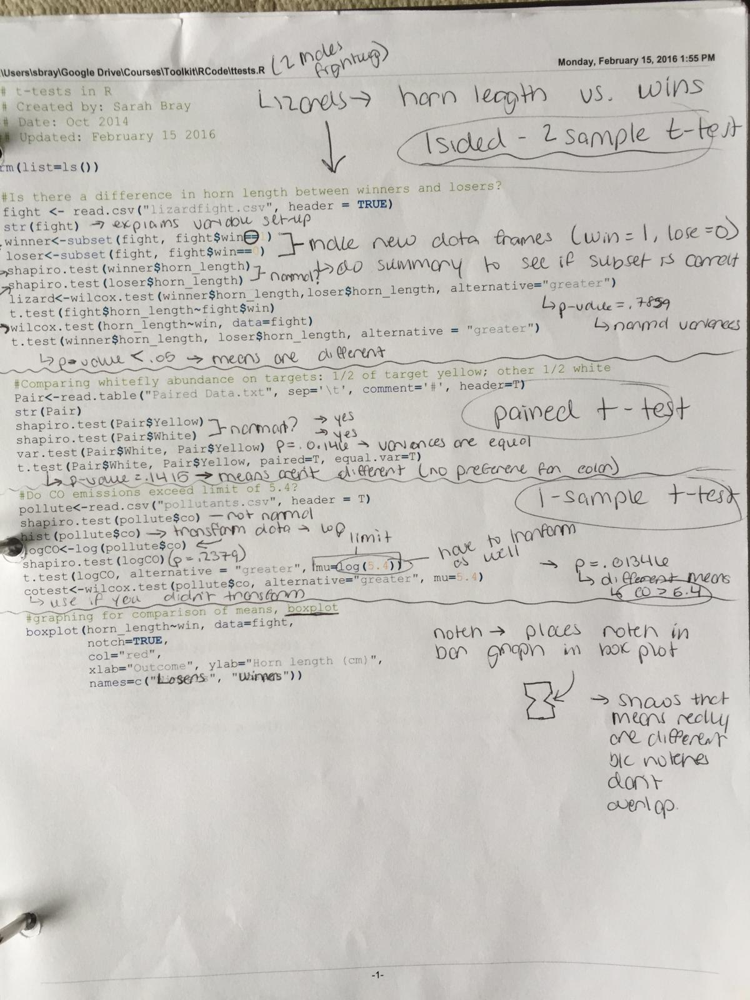

## 1. Find a paper in the journal *Ecology*, *Ecological Applications*, or *Journal of Wildlife Management* that uses one of the methods we have learned in class this semester and has R code included as an online supplement. 

## 2. Describe what was done in the methods (experimental design and analysis). Explain why you think this is an appropriate analysis based on what you've learned in this course.

## 3. Print out the online supplementary R code and annotate it by hand next to the code. Describe what each line of code is doing and why. Indicated where you do not konw or are confused (do not put this for the whole thing).

