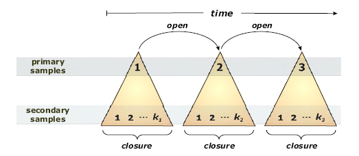

```{r setup, include=FALSE}
knitr::opts_chunk$set(echo = TRUE)
```

## Learning objectives

* Understand the limitations of open and closed population methods and improvements using the robust design.
* Describe the structure of the robust design

Define:
 
* super-population
* temporary emigration
* permanent emigration 
* survival
* fidelity
* encounter probability
* apparent encounter probability
* return rate

## Design



## Survival vs. Apparent Survival


## Population vs. Super-Population

What's the difference between population and the super-population?

## Encounter (detection)

Apparent Encounter Probability - probability of encounter given available

$$
p = (1 - \gamma) p^*
$$

where $p^*$ is the probability of encounter (*e.g.* sighted, captured, detected)

## Temporary Emigration vs. Permanent Emigration

temporary emigration $\gamma$

## Return Rate

$$
R = S F(1 - \gamma) p^*
$$

## Two Gammas

$\gamma^`$ vs. $\gamma^{``}$

